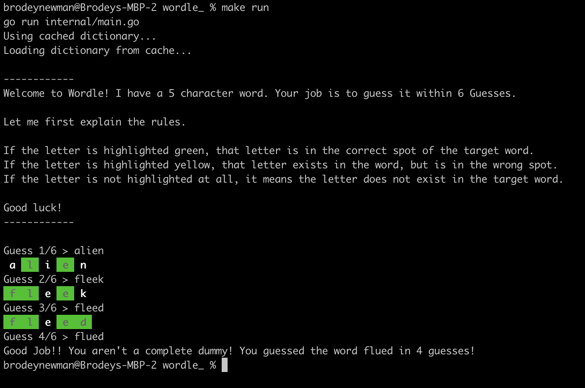

# Wordle

Actively learning Go, so figured this would be a fun little projec to build.



## Running the program

```bash
make run
```

If this is your first time running the app, it will cache the dictionary of words on your machine.
Otherwise, it will use a cached version of the words under the `.cache` directory in this project.

Have fun!